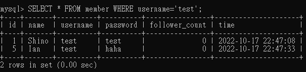
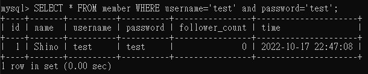
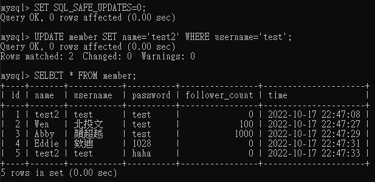
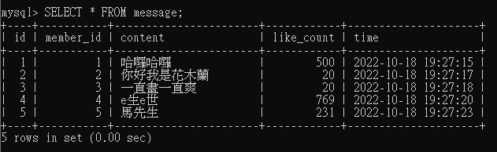
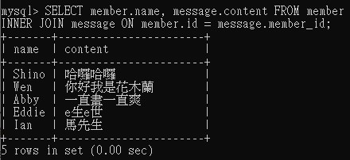
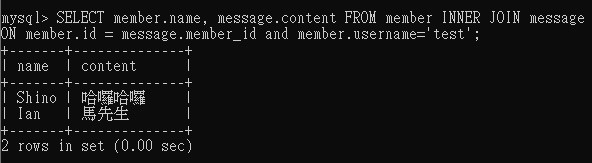
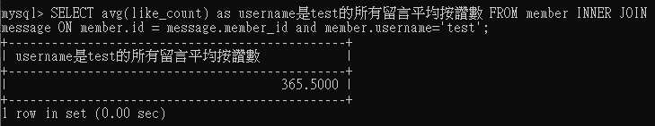

## 要求三：SQL CRUD

- 使⽤ INSERT 指令新增⼀筆資料到 member 資料表中，這筆資料的 username 和password 欄位必須是 test。接著繼續新增⾄少 4 筆隨意的資料。
- 使⽤ SELECT 指令取得所有在 member 資料表中的會員資料。
   

- 使⽤ SELECT 指令取得 member 資料表中第 2 ~ 4 共三筆資料，並按照 time 欄位，
由近到遠排序。( 並非編號 2、3、4 的資料，⽽是排序後的第 2 ~ 4 筆資料 )

- 使⽤ SELECT 指令取得欄位 username 是 test 的會員資料。
  
  
- 使⽤ SELECT 指令取得欄位 username 是 test、且欄位 password 也是 test 的資料。
  
  
- 使⽤ UPDATE 指令更新欄位 username 是 test 的會員資料，將資料中的 name 欄位改
成 test2。

## 要求四：SQL Aggregate Functions

- 取得 member 資料表中，總共有幾筆資料 ( 幾位會員 )。
- 取得 member 資料表中，所有會員 follower_count 欄位的總和。
- 取得 member 資料表中，所有會員 follower_count 欄位的平均數。
  

## 要求五：SQL JOIN (Optional)
1. 在資料庫中，建立新資料表紀錄留⾔資訊，取名字為 message。資料表中必須包含以
下欄位設定：

- 使⽤ SELECT 搭配 JOIN 語法，取得所有留⾔，結果須包含留⾔者會員的姓名。
  

- 使⽤ SELECT 搭配 JOIN 語法，取得 member 資料表中欄位 username 是 test 的所有留⾔，資料中須包含留⾔者會員的姓名。

- 使⽤ SELECT、SQL Aggregate Functions 搭配 JOIN 語法，取得 member 資料表中欄位 username 是 test 的所有留⾔平均按讚數。